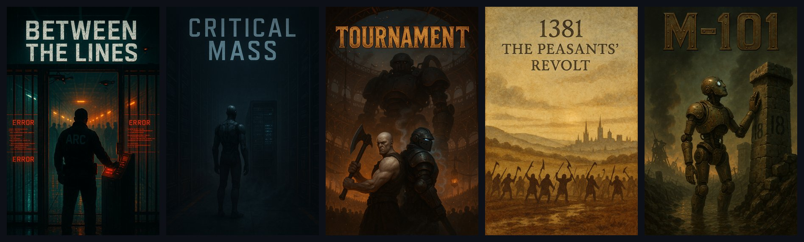

# Prose

A local novel-writing engine: SQL Server canon for whole fictional universes, a desktop Writer, and a CLI and MCP server so Claude can draft, read and repair books against that canon.

[](https://dotnet.microsoft.com/) [](https://learn.microsoft.com/dotnet/csharp/) [](docs/schema.md) [](docs/MCP%5FTOOLS.md) [](#quick-start) [](#limitations)



Prose runs on your own machine. There is no hosted version: the hosted deployment was retired on 2026-08-23 and the project is local-only by design.

## Why

- Keep a whole fictional universe straight. Characters, places, factions, gear and in-world documents live in one SQL Server database with a relationship graph and full temporal history, so a fact is stored once and every book reads the same one.
- Write a novel with Claude without losing the plot between sessions. The work queue, recorded decisions and read receipts live in the database, so the next session starts from the book's real state, not from someone's memory of it.
- Never ship a book nobody has read. The read gate refuses to export while any beat is unread as it stands, and there is no override.
- Edit prose by hand in a real editor. The Writer is a desktop window over the same database the CLI and MCP tools use.
- Know which checks earn their keep. Every quality instrument is measured by how many of its findings were ever applied; the ones that never helped are switched off, not left burning tokens.
- Run several universes side by side (cyberpunk, fantasy, horror, nonfiction and more) with scoping that fails closed instead of leaking one universe into another.

## Features

### One resident server

Prose.Hub is an ASP.NET Core process bound to `127.0.0.1:5900`. It is the only process that touches the database. It hosts the engine's services, the Writer pages and an observability dashboard. The CLI and the MCP server are thin clients that forward every call to it and refuse to start when it is not healthy.

### The Writer

`Writer.exe` is a WPF + WebView2 window that finds or starts the Hub and opens its `/writer` page. The editor itself (`Prose.WriterUi`) is compiled into the Hub, with a book editor, a reader view (`/read`) and a canon browser (`/repo`). `Launcher.exe` is a small picker that opens the Writer or the KDP publishing app, starting the Hub first when needed.

### The observability dashboard

`Prose.ObserverUi` is served by the Hub at `/app`: dashboard, beats, logs, a 2D and 3D graph view, Dynamic Context Memory runs and the canon repositories, pushed live over SignalR.

### The Novel Factory

The current way of working (RFC 0015, approved 2026-09-23). Every book moves through computed stations: planned, written, captured, read, clean, verified, pressed. Work is driven by work orders, decisions are recorded as rulings, and each Claude session is a row in the database. No LLM judges, votes or scores. See [The Novel Factory](#the-novel-factory) below.

### Canon as a database

Every canon row belongs to exactly one universe. Books are a tree of nodes (series, book, chapter) over beats, the atomic unit of story. Beats and nodes are system-versioned, so every edit can be rewound. Entities carry embeddings, typed relationship edges with story-time validity windows, and an append-only state ledger.

### Writing and repair tools

- Exact-text splices across a whole book, dry run first, verified by read-back (`--splice-beats`).
- Read in true order with each beat's recorded point-of-view character attached (`--read-beats`), with read receipts and read notes.
- Clone, archive and restore books; move beats between books byte for byte.
- An enriched generation pipeline (`ProseWriterRouter`) for drafting beats from canon.

### Checks that stay on

- The logic sweep: causality, knowledge states, timeline, plant and payoff, orphan references and inserted-beat drift.
- Ledger adjudication: same-predicate contradictions in the fact ledger, judged against the prose they came from.
- A deterministic prose linter for echo words, crutch phrases, pet words and attribution runs.
- Text integrity scanning for corrupted currency symbols, dashes and diacritics.

### Export and audio

`--export-node` renders a book to .docx, EPUB, PDF and plain text with metadata files. Audiobook export renders a whole book through ElevenLabs. A separate WPF app, Prose.KdpPublish, drives the Amazon KDP site to publish and republish books.

### MCP server

285 tools in 51 families, surfaced to any MCP client as `mcp__prose__<name>`. Claude can read and write beats, entities, rulings and work orders through the same Hub the CLI uses.

## Quick start

Prerequisites:

- Windows (the Writer, Launcher and KdpPublish are WPF apps; the deploy scripts are PowerShell).
- .NET 10 SDK.
- SQL Server LocalDB (the default connection is `(localdb)\MSSQLLocalDB`, database `Prose`).
- At least one LLM provider key, only for the commands that call a model (see [LLM providers](#llm-providers)).

Clone, wire up the git hooks and build:

```powershell
git clone https://github.com/mindattic/Prose.git
cd Prose
git config core.hooksPath .githooks
dotnet build src\Prose.slnx
```

Without the `core.hooksPath` line the repo's `pre-commit` and `post-commit` hooks silently never run.

Publish and start the Hub. It applies any pending EF Core migrations at startup, then waits for `/api/health`:

```powershell
powershell -ExecutionPolicy Bypass -File src\tools\deploy-apps.ps1 -Apps Hub -Start Hub
```

Enable temporal versioning on a fresh database and check the CLI can reach the Hub:

```powershell
.\prose.cmd --migrate-sql --schema
.\prose.cmd agent bootstrap
.\prose.cmd --list-books --universe glmz
```

`agent bootstrap` prints `ready` when the Hub is healthy. Open the editor:

```powershell
powershell -ExecutionPolicy Bypass -File src\tools\deploy-apps.ps1 -Apps Writer -Start Writer
```

Register the MCP server with Claude Code (one time):

```bash
claude mcp add prose dotnet run --project <path-to-your-clone>/src/Prose.Mcp/Prose.Mcp.csproj --no-build --configuration Release
```

Build `src/Prose.Mcp` in Release first. The tools appear as `mcp__prose__*`. For Claude Desktop, see [src/Prose.Mcp/README.md](src/Prose.Mcp/README.md).

## How it works

```text
 prose.cmd / Prose.Cli ----POST /api/cli-invoke----+
 Prose.Mcp (stdio MCP) ----POST /api/mcp-invoke----+
 Prose.Writer.exe (WebView2) ----GET /writer-------+--> Prose.Hub (Hub.exe, 127.0.0.1:5900) --> SQL Server
 Prose.Launcher.exe ----starts the Hub if down-----+      hosts the Prose.Core services,
                                                          Prose.WriterUi (/writer, /read, /repo)
                                                          and Prose.ObserverUi (/app)
```

- **The Hub owns the database.** It holds the Core services, the universe graph and the Dynamic Context Memory state. Every other front door forwards into it.
- **The CLI and MCP server are thin clients.** Both refuse to start when the Hub is not healthy (`HubGate.EnsureReachableOrExit`, no in-process fallback). The CLI forwards a handler class name plus its arguments; the Hub's `CliDispatch` runs the handler from `Prose.Cli`. MCP tools forward through `HubInvoker` to `/api/mcp-invoke`, where `ToolDispatch` runs the tool's body.
- **The Writer is a window, not an app.** `Prose.Writer` has no `Prose.Core` reference. All editor code lives in `Prose.WriterUi`, compiled into the Hub, so an editor change needs a Hub redeploy.
- **Fail-closed health.** `/api/health` returns 503 when SQL Server is unreachable. Protected endpoints take an `X-Prose-Key` header that the CLI and MCP server read from `Settings.json`.
- **Universe scope travels with each call.** Pass `--universe <slug>` or set `PROSE_UNIVERSE`. A content command with no universe is refused rather than defaulted.

Hub HTTP endpoints include `/api/health`, `/api/cli-invoke`, `/api/mcp-invoke`, `/api/factory/*`, `/api/universes/*`, `/api/outbox/{consumer}`, `/api/generate-scene` and `/api/agent/bootstrap`, plus SignalR at `/hubs/observability`.

### Data layer principles

1. **SQL is the only canon store.** Markdown and JSON files are documentation or export mirrors, never the live read path. `engine_data/*.json` is a seed and export mirror, not canon.
2. **Temporal tables.** `Beats`, `Nodes` and other canon tables are system-versioned, so every edit is rewindable with `FOR SYSTEM_TIME ALL`.
3. **Static and dynamic facts are split.** Identity facts (name, height, ancestry) live on entity tables; story state (location, ammunition, life status) lives in the append-only `EntityStateEvents` ledger.
4. **One format.** Everything is a tree of nodes over beats: `SeriesNode`, `BookNode` and `ChapterNode` on one `Nodes` table, linked by `ParentNodeId`.
5. **Every row belongs to exactly one universe.** Enforced by an EF Core global query filter keyed on `IUniverseContext`, not by convention. An entity needed in two universes gets two rows.
6. **Nothing reaches the database except through the Hub**, reads and writes, no exceptions (2026-08-22). No raw `sqlcmd`, not even a read-only lookup.

## The Novel Factory

RFC 0015 replaced loose plans and memory with state in the Hub. The agent protocol is [docs/agent/PROSE\_PROTOCOL.md](docs/agent/PROSE%5FPROTOCOL.md); the design is [docs/rfc/0015-novel-factory.md](docs/rfc/0015-novel-factory.md).

### The laws

1. The book is its beats; the world is its entities. No outline, spine, blueprint, ledger or summary is stored about the story.
2. Every story change is a logged Hub call (MCP or the CLI). Never raw SQL.
3. Repo changes need an open engine work order whose paths cover them, and a commit that names it (`WO:<id>`).
4. Done is computed (a station passes) or Hub-validated (a work order's checks). Claims do not count.
5. A decision goes into the world the moment it is made, as a ruling or an entity record, with a read-back.
6. The book is read and written whole. A chapter is a unit of work, never a boundary of sight.
7. Deterministic checks only. No LLM judges, votes or scores.
8. A failed check is reported, never compensated with a new system.
9. No override on the read gate. Export only what has been read as it stands.
10. Every session ends with a summary in which every decision references a ruling or an order.

### The line

| Station | Scope | Passes when | Cleared by |
| --- | --- | --- | --- |
| F2 Planned | chapter | at least one beat, and each has text or a title and a description | `insert_beat` |
| F3 Written | chapter | every beat has text and a recorded write reason | `update_beat_text`, `splice_beats` |
| F4 Captured | chapter | no uncaptured names and no untagged known names | `create_*`, `add_entity_tags`, an incidental ruling |
| F5 Read | chapter | the read gate shows every beat read as it stands | `read_beats` with `markRead` |
| F6 Clean | chapter | no open defect notes and no law-pattern hits in the prose | `splice_beats`, re-read, `resolve_read_note` |
| F1 Verified | chapter | every tagged entity verified at its current version | `verify_entity_begin`, `verify_entity_commit` |
| F7 Pressed | book | all chapters pass, metrics pass, docx, epub and pdf exports at the current fingerprint | `--export-node` |
| A Audio | book | an mp3 export at the current fingerprint | audiobook export |

The read gate marks a beat unread when its text changes, when it moves, or when an entity it mentions changes. `factory_next` walks chapters in reading order and returns the first actionable station.

```powershell
prose --factory next --universe glmz
prose --factory status --node <book> --universe glmz
prose --order list
prose --read-beats --slug <book> --from 1 --to 40 --universe glmz
prose --read-status --node <book> --list --universe glmz
prose --splice-beats --node <book> --file docket.json --universe glmz            # dry run
prose --splice-beats --node <book> --file docket.json --apply --universe glmz    # apply
prose --export-node --slug <book> --universe glmz
```

The first book through the full line was *Bushido Coda*: one in-order read of all 521 beats, one entity batch, a re-read of every beat the gate flagged, verification of 114 tagged entities, then the press (V73, 2026-09-23).

## Writing and the generation pipeline

Since RFC 0009 (2026-09-06) no service rewrites finished prose on its own. Writing happens in session, with the full prior prose and the cast's records in view (`factory_context`), and every change goes through the one prose door (`NodeWorkbenchService` and `BeatSpliceService`).

`ProseWriterRouter` remains the single entry point for generating a beat from canon (`--expand-beat`, `--generate-scene`). It assembles a wide context before calling the model. Its current inputs, from its constructor:

| Input | What it adds |
| --- | --- |
| `BeatModeDetector` | classifies the beat as combat, narrative, emotional climax, dialogue, transition or revelation |
| `StoryMethodologyService` | the beat's structural role and scene or sequel type |
| Combat rules | verbs first, fragments, no emotion-naming, shared with `CombatSceneWriter` |
| `SceneContextBuilder` | ambient sensory grounding, including the New Weird anomaly layer |
| `DialogueService` | per-character voice and subtext on dialogue beats |
| `SceneContextAssembler` | an X-ray of everyone on the page: voice, psychology, wounds, behaviour |
| `ContinuityService`, `ContinuityEnforcer` | confirmed fact constraints for on-page characters |
| `TensionEscalationService` | warns when beats stall at low intensity |
| `ConsequenceService` | gear, cyberware and status constraints |
| `WorldStateAtBeatService` | what is true at this point in the story |
| `NarrativeObligationService`, `PlantPayoffService` | open obligations and active plant and payoff pairs |
| `BookStateLedgerService` | arc-level state for long books |
| `StoryScienceService` | sacred-flaw consistency, status dynamics, curiosity gap, causal chains |
| `NarrativeChartService` | offscreen activity of other characters |
| `UniverseGraphService` | flags invented proper nouns that are not in canon |
| `CanonGroundingService`, `SemanticFidelityService`, `LibertyReportService` | canon grounding, intent drift and rule-of-cool checks |
| `BookAuditService` | gateway or sequel commandments |
| `BeatBriefBuilder`, `BriefVerifier` | a brief for the beat and a check that the draft meets it |
| `DocContextService` | Dynamic Context Memory, the layered retrieval of canon documents |

`CombatSceneWriter.WriteCombatSceneAsync` handles multi-exchange combat set pieces (loadouts, ammunition, bio-battery). `BeatGeneratorService` is the lower layer and is not called directly from new code.

### Local or rented GPU generation

Route generation to any OpenAI-compatible endpoint, such as Ollama on a rented GPU, without editing configuration. The overrides are per command:

```powershell
prose --expand-beat --slug <slug> --universe glmz `
   --local-url  https://<pod-id>-11434.proxy.runpod.net/v1/chat/completions `
   --local-model qwen2.5-32b-writer
```

Flags: `--local` (use the stored `LocalLlmBaseUrl`), `--local-url`, `--local-model`, `--local-key`.

## Quality checks

The 0 to 100 score gates and persona vote panels are retired (SS-A44, 2026-08-03). A named, fixable finding tells you more than a number.

On 2026-09-22 RFC 0014 measured every instrument by its findings: 30,745 filed, all time, and 8 ever applied. Three producers earned those 8, and they stay live:

| Instrument | Command | Applied findings |
| --- | --- | --- |
| LEDGER-CONFLICT | `--ledger-adjudicate` | 5 |
| LOGICSWEEP | `--logic-sweep` | 2 |
| LINT | `--lint-prose` | 1 |

Thirty commands were switched off, among them the reader panels, the craft checklist, the continuity and contradiction finders, the obligation ledger, the scanners and the nightly AutoCorrect battery. Nothing was deleted: each handler is intact, the CLI explains why when you call one, and deleting its line from `src/Prose.Cli/DeactivatedInstruments.cs` brings it back. `--findings` (including `--findings stats --by-instrument`) and `--publish-readiness` stay live, because they are how an instrument earns its way back.

### The logic sweep

Codified from [docs/LOGIC.md](docs/LOGIC.md). One model call per dimension over the book's enabled beats:

1. Causality chain: every event has a cause, every decision a motivation.
2. Knowledge states: who knows what, and when they learned it.
3. Timeline: the book's internal clock, checked for impossibilities.
4. Plant and payoff, both ways.
5. Orphan references to removed, disabled or merged content.
6. Inserted-beat drift.

Findings are triaged BLOCKER, MODERATE or MINOR. Exit code 0 is clean, 1 is moderate or minor only, 2 is any blocker.

```powershell
prose --logic-sweep --slug <slug> --universe glmz
prose --logic-sweep --slug <slug> --until-dry --required-dry 2 --max-rounds 8 --universe glmz
```

`--until-dry` runs one convergence round per call. State lives in `NodeConvergenceStates`, keyed to a fingerprint over every enabled beat's text, so an unchanged book skips the round at no cost and any edit resets the dry-round count. Hitting the round cap files a not-converging finding instead of looping forever.

Every beat save also triggers a narrow sweep of its blast radius: the edited beat, its neighbours within three positions, and every beat elsewhere in the book that mentions the same entity (`BlastRadiusService`).

### Ledger adjudication

The fact ledger (`ContinuityClaims`) holds `(entity, predicate, object)` claims extracted from prose. `--ledger-adjudicate` judges same-predicate contradiction groups against the prose they came from. It writes claim status only, never prose, and is cost-gated: one model call per uncached group, cached on the claim ids and every anchor beat's text hash. Numeric predicates such as `age` or `tenure_years` compare as numbers, so "fifty" and "50" are one claim. Its best catch: Kyle's residence given as "eleven years" in one place and "four years" in another, the spine of *Bushido Coda*.

### Text integrity

`--check-text-integrity [--fix] [--json]` scans every beat and every book bible across all universes for two corruption signatures: U+FFFD, and stray control characters below 32 other than tab, line feed and carriage return. `--fix` repairs only three unambiguous patterns (U+FFFD before a digit becomes the currency symbol Φ; a control character between two spaces becomes an em dash; one before a digit becomes §). Everything else is reported for a human. The scan compares characters in C#, never with SQL `CHARINDEX`, which returned false negatives for U+FFFD under this database's collation.

### World graph health

`UniverseGraphService` builds an in-memory graph over every entity in the active universe. It is a projection rebuilt from SQL, never the store of record; the JSON snapshots under `engine/data/graph/` are an output cache written by `--rebuild-graph`.

`--graph-health --universe <slug> [--used-in-prose-only]` reports orphaned nodes, weakly connected nodes and suspicious names, at no model cost. Most orphans are deliberate flavour (guns, drugs and minor characters seeded for depth). `--used-in-prose-only` keeps only entities that actually appear in prose: on GLMZ (2026-08-15) that cut 789 orphans and 8,660 weak links down to about 206 entities that really needed edges.

Relationships that are only true for part of a story are `Edges` rows with `StoryValidFrom` and `StoryValidUntil`. `--world-state --beat <id> [--story-time <date>]` shows what is true at that point; the reference example is Kyle's motorcycle, owned until its destruction and owned again when the rebuilt Mk. 2 is revealed.

## Commands

`prose.cmd` at the repo root runs `dotnet run --project src/Prose.Cli -- <args>`. Most commands need a universe: `--universe <slug>` or `PROSE_UNIVERSE`.

The full, generated reference is [docs/CLI\_COMMANDS.md](docs/CLI%5FCOMMANDS.md): 277 commands, 30 deactivated, 10 cost-gated. Regenerate it with `prose --export-commands`, which runs without a Hub. The tables below are a guide to the commands you will use most.

### Factory and reading

| Command | What it does |
| --- | --- |
| `--factory status`, `next`, `capture`, `context`, `journal`, `usage` | the factory's computed state and next action |
| `--order add`, `list`, `show`, `close`, `abandon`, `seed` | engine and author work orders |
| `--ruling add`, `list`, `supersede`, `violations`, `metrics`, `seed` | recorded decisions and law patterns |
| `--session end` | close the factory session with a summary |
| `--read-beats --slug <slug>` | read beats in true order, each with its recorded POV character |
| `--read-status --node <book>` | which beats are unread, and why |
| `--read-note add`, `list`, `resolve` | defects, questions and notes filed during a read |
| `--set-character-fields`, `--set-entity-fields` | the world's write path, JSON Merge Patch with read-back |
| `--verify-entity begin`, `commit` | station F1 |

### Books and beats

| Command | What it does |
| --- | --- |
| `--list-books` | every node as a table or JSON |
| `--create-book`, `--ensure-chapter` | create books and chapters |
| `--splice-beats --node <book> --file <docket.json>` | exact-text replacements across a book, all or nothing, dry run unless `--apply` |
| `--edit-beat`, `--merge-beats`, `--move-beat`, `--move-beat-to-node` | beat-level surgery |
| `--reparent-node`, `--renumber-chapters`, `--rename-node` | structure |
| `--archive-book`, `--list-archives`, `--restore-beat-text` | snapshots and restores |
| `--clone-book --slug <slug> --draft` | clone a book to rebuild it while the original stays frozen |
| `--expand-beat`, `--generate-scene` | generate prose through `ProseWriterRouter` |
| `--print-book`, `--grep-beats` | print or search a book |

### Quality

| Command | What it does |
| --- | --- |
| `--logic-sweep --slug <slug>` | the six-dimension logic sweep |
| `--ledger-adjudicate --slug <slug>` | judge fact-ledger contradictions against the prose |
| `--lint-prose --slug <slug>` | deterministic prose linter |
| `--check-text-integrity` | corrupted-character scan and safe fixes |
| `--publish-readiness --slug <slug>` | the gate report as one read-only readout |
| `--findings` | the findings inbox and per-instrument statistics |
| `--graph-health --universe <slug>` | world graph integrity |
| `--world-state --beat <id>` | the state of the world at one beat |
| `--fix-cross-universe-contamination` | repair cross-universe roster or POV leaks |

### Canon and world

| Command | What it does |
| --- | --- |
| `--add-character`, `--add-place`, `--add-faction`, `--add-weapon`, `--add-corponation` | seed typed entities from JSON |
| `--find-entity`, `--show`, `--entity-mentions` | look up an entity and where it appears |
| `--rename-entity`, `--merge-entity`, `--add-alias` | rename, merge and alias entities |
| `--generate-glossary`, `--generate-book-glossary` | universe and book glossaries |
| `--rebuild-graph`, `--reembed` | rebuild the graph; re-embed entities |
| `--universe-import`, `--universe-export`, `--universe-sync` | the Universe Interchange format |

### Export and publishing

| Command | What it does |
| --- | --- |
| `--export-node --slug <slug>` | .docx, .epub, .pdf and .txt plus description, synopsis and a DCM visualisation |
| `--publish-audiobook`, `--export-mp3` | the whole book as one audiobook via ElevenLabs |
| `--narrate-book` | re-narrate an existing book |
| `--prepare-audible` | prepare an Audible upload |
| `--kdp-manifest`, `--kdp-status`, `--kdp-mark-published` | the KDP publishing store |

### Infrastructure

| Command | What it does |
| --- | --- |
| `--migrate-sql --schema` | apply EF Core migrations and enable temporal versioning; idempotent |
| `--seed <name>` | apply a registered raw T-SQL seed (`SqlSeedService.Seeds`) |
| `--sync-markdown` | mirror hand-written Markdown into the `MarkdownFiles` table |
| `--provider-status` | degraded-provider report |
| `--estimate-cost`, `--cost` | model-call cost estimates and the running cost ledger |
| `--command-log`, `--log-search` | the Hub's command ledger and log files |
| `agent bootstrap` | tell a new agent how to get ready; works without a Hub |

Cost-gated commands spend model money and route through the Hub's cost gate; everything else is deterministic or read-only.

## MCP server

`Prose.Mcp` exposes 285 `[McpServerTool]` methods in 51 families. The generated reference, with parameters and descriptions, is [docs/MCP\_TOOLS.md](docs/MCP%5FTOOLS.md). Regenerate it with:

```powershell
dotnet run --project src/Prose.Mcp -- --export-tools docs/MCP_TOOLS.md
```

The server is a Hub client: each tool forwards to `/api/mcp-invoke` with the caller's universe and the Hub key. Many tools write (beat text, entity fields, rulings, work orders). Factory tools include `factory_next`, `factory_context`, `read_beats`, `splice_beats`, `record_ruling`, `work_order_add` and `verify_entity_begin`. Cross-universe lookups (`get_universe_entity`, `search_universe`) do not switch the session's universe; `switch_universe` does.

Agent hosts other than Claude use the same protocol. `prose agent bootstrap --json` is the CLI fallback; [AGENTS.md](AGENTS.md) and [docs/agent/PROSE\_PROTOCOL.md](docs/agent/PROSE%5FPROTOCOL.md) are the entry points.

## Database

```text
Server=(localdb)\MSSQLLocalDB;Database=Prose;Trusted_Connection=True;TrustServerCertificate=True;
```

Windows authentication. The connection string resolves from the `ConnectionStrings__Prose` environment variable, then `appsettings.json` (`ConnectionStrings:Prose`), then the LocalDB default. The Hub applies pending EF Core migrations at startup and refuses to start if one fails.

The schema reference is [docs/schema.md](docs/schema.md), generated by `tools/gen-schema.ps1` (snapshot 2026-08-14; the factory tables came later). Key tables:

| Table | Role |
| --- | --- |
| `Entities` | the universal spine: one row per entity with name, slug, type and universe |
| `Nodes`, `Beats` | the system-versioned content tree and the prose beats |
| `BeatNodes` | joins beats to nodes with a sort key; a row's presence is what enables a beat |
| `EntityEmbeddings` | 1536-dimension vectors from OpenAI `text-embedding-3-small` |
| `Edges` | typed directed relationships with story-time validity windows |
| `EntityStateEvents` | append-only story-time ledger for quantities and status |
| `ContinuityClaims` | the fact ledger: NEW, CONFIRMED, CONTRADICTED, CANONICAL, REJECTED or SUPERSEDED |
| `BeatReadReceipts`, `BeatReadNotes` | read receipts and the notes a read filed |
| `Rulings` | recorded decisions, including law patterns |
| `WorkOrders`, `FactorySessions`, `EntityVerifications`, `Exports` | the factory's state |
| `CommandLedgerEntries` | every Hub call, with the actor that made it |
| `ArchivedBooks` | whole-book prose snapshots |
| `NodeConvergenceStates` | logic-sweep convergence per book |
| `LlmCallHistories` | every provider hop with model, success, tokens and cost |
| `Findings` | the findings inbox |
| `CanonDocumentSections` | hand-written canon sections that generate the Codex docs |
| `MarkdownFiles` | system-versioned mirror of the repo's Markdown files |
| `Universe`, `UniverseProfiles` | registered universes and their profiles |
| `PlantPayoffs`, `GlossaryTerms` | plant and payoff registry; universe glossary |

Raw T-SQL under `src/Prose.Core/Data/Sql/` is mostly historical. If a fresh database lacks rows from one of those scripts, register it in `SqlSeedService.Seeds` and run it with `prose --seed <name>`; never apply it by hand.

## Universes

Every canon and story row belongs to exactly one universe ([docs/BIBLE.md](docs/BIBLE.md), SS-LAW-15). Each has a folder under [docs/universes](docs/universes).


| Universe | Slug | Genre | Docs |
| --- | --- | --- | --- |
| GLMZ | `glmz` | cyberpunk, Great Lakes Metropolitan Zone, 2226; the flagship (*Bushido Coda*) | [docs/GLMZ.md](docs/GLMZ.md), [docs/WORLD.md](docs/WORLD.md) |
| SCRY | `scry` | fantasy and steampunk (the Entos, the Caul) | [docs/SCRY.md](docs/SCRY.md), [docs/universes/ENTOS.md](docs/universes/ENTOS.md) |
| NONFICTION | `nonfiction` | citation-grounded nonfiction (formerly GSPL, then SOURCE) | [docs/NONFICTION.md](docs/NONFICTION.md) |
| GOSPEL | `gospel` | split from NONFICTION; New Testament claims catalogue | [docs/gospel](docs/gospel) |
| HORROR | `horror` | ambiguous and analog horror | [docs/HORROR.md](docs/HORROR.md) |
| FICTION | `fiction` | general literary fiction (formerly EPIC) | [docs/universes/FICTION](docs/universes/FICTION) |
| EROTICA | `erotica` | added 2026-08-04 | [docs/universes/EROTICA](docs/universes/EROTICA) |


Scoping fails closed: an unset or unknown universe blocks the command instead of defaulting, the fix for an earlier cross-universe content leak. Two terminals or sessions can target different universes at once.

### Universe Interchange

Prose is also a store other MindAttic apps read and write (RFC 0007). The contract is one JSON file per universe, `<app>/universe/<slug>.universe.json`, described by [docs/schemas/universe.schema.json](docs/schemas/universe.schema.json): a universe header plus entities with type, summary, details, relations and tags.

- **Import and export.** `UniverseInterchangeService` maps entities onto the entity spine. Import is an idempotent upsert by universe and slug; a relation to an unknown entity creates a stub that is promoted when its own row arrives.
- **CLI:** `--universe-import <path>`, `--universe-export <slug> <path>`, `--universe-sync <path>`.
- **MCP:** `import_universe_file`, `export_universe_file`, `get_universe_entity`, `search_universe`.
- **Hub HTTP:** `POST /api/universes/{slug}/import` plus reads of entities, neighbours, search, snapshot and stats.
- **The Outbox:** `GET` and `POST /api/outbox/{consumer}` queue one-line messages for another app's Claude session; `?peek=true` reads without marking delivered.
- **Scenes on demand:** `generate_scene`, `prose --generate-scene` or `POST /api/generate-scene` writes a scene or a line of dialogue without a book row, with canon grounding intact.
- **Barks:** `--barks-export <universe> <path>` emits every single-speaker beat as `{barkId, speakerEntitySlug, text, context}`.

The first consumer is [ExperimentEve](https://github.com/mindattic/ExperimentEve). The runbook for the next one is [docs/CONSUMER\_ONBOARDING.md](docs/CONSUMER%5FONBOARDING.md).

## LLM providers

`LlmRouter` is the fallback chain: it tries the active provider (`claude` by default), then walks `ActiveLlmProviderChain` in order. Any exception on a hop moves to the next. Every hop is logged to `LlmCallHistories`.

| Provider kind | Services |
| --- | --- |
| Metered API keys | `ClaudeService`, `OpenAiService`, `GeminiService`, `DeepSeekService`, `MistralService`, `KimiService`, `PerplexityService` |
| Subscription CLIs | `CodexCliService`, `GeminiCliService` shell out to the `codex` and `gemini` CLIs and ride their login; costed at $0 |
| Fan-out | `MultiLlmService` over MindAttic.Legion (adds Grok, Groq, Together, OpenRouter, Fireworks, Cohere) |
| Last resort | `Prose.LlmCli` (`prose-llm`), a standalone CLI with no `Prose.Core` reference |

`prose-llm` works even when Core or the database does not:

```text
prose-llm --provider <id> --prompt <text-or-@file-or-dash> [--system <text>] [--temperature <n>] [--max-tokens <n>] [--model <id>] [--json]
```

API keys resolve through `SettingsService.ResolveApiKey`: Vault configuration, then Prose's own app-scoped key, then a `PROSE_*` environment variable, then the shared MindAttic credential store under `%APPDATA%/MindAttic/LLM/`, then a legacy `Settings.json` field. There is no CLI or MCP command to switch the active provider; edit `ActiveLlmProviderChain`. [docs/PROVIDERS.md](docs/PROVIDERS.md) lists which services depend on which provider.

## Configuration

All environment variables are optional; set only what a feature you use needs.

| Group | Variables |
| --- | --- |
| LLM providers | `PROSE_CLAUDE_API_KEY`, `PROSE_OPENAI_API_KEY`, `PROSE_GEMINI_API_KEY`, `PROSE_DEEPSEEK_API_KEY`, `PROSE_MISTRAL_API_KEY`, `PROSE_KIMI_API_KEY`, `PROSE_PERPLEXITY_API_KEY`, `PROSE_GROK_API_KEY`, `PROSE_GROQ_API_KEY`, `PROSE_TOGETHER_API_KEY`, `PROSE_OPENROUTER_API_KEY`, `PROSE_FIREWORKS_API_KEY`, `PROSE_COHERE_API_KEY` |
| Audio and media | `PROSE_ELEVENLABS_API_KEY`, `PROSE_IDEOGRAM_API_KEY`, `PROSE_FAL_API_KEY`, `PROSE_STABILITY_API_KEY`, `PROSE_KLING_API_KEY`, `PROSE_RUNWAY_API_KEY` |
| Maps | `PROSE_MAP_APP_ID`, `PROSE_MAP_API_KEY`, `PROSE_GOOGLE_MAPS_API_KEY` |
| SMTP | `PROSE_SMTP_HOST`, `PROSE_SMTP_PORT`, `PROSE_SMTP_USERNAME`, `PROSE_SMTP_PASSWORD`, `PROSE_SMTP_FROM` |
| Paths | `PROSE_DATA_ROOT`, `PROSE_MUTABLE_DATA_ROOT`, `PROSE_REPO_PATH` |
| Universe | `PROSE_UNIVERSE`, the default universe for CLI commands |
| KDP | `PROSE_KDP_DB`, `PROSE_KDP_TOOLS_DIR` |
| Local TTS | `PROSE_PYTHON`, `PROSE_CA_BUNDLE`, `PROSE_PIPER_EXE`, `PROSE_PIPER_MODEL` |
| Database | `ConnectionStrings__Prose` |

Run the Hub with `ASPNETCORE_ENVIRONMENT=Development`, or MindAttic authentication fails closed (only `--reset-password` is affected).

## Project layout

```text
Prose/
  prose.cmd                 the CLI shim (dotnet run on src/Prose.Cli)
  deploy-*.bat, writer.bat  shortcuts that call src/tools/deploy-apps.ps1
  src/
    Prose.slnx
    Prose.Core/             engine: EF Core context and entities, services, Services/Factory/
    Prose.Hub/              Hub.exe: minimal-API endpoints, SignalR, dispatch to CLI and MCP code
    Prose.Hub.Contracts/    DTOs shared by the Hub and its UI clients
    Prose.Cli/              the prose command; Cli/ holds about 300 handler classes
    Prose.Mcp/              stdio MCP server; Tools*.cs, one class per area
    Prose.WriterUi/         the editor (Razor class library hosted by the Hub)
    Prose.ObserverUi/       the observability dashboard at /app
    Prose.Writer/           Writer.exe, the WPF + WebView2 window
    Prose.Launcher/         Launcher.exe, opens Writer or KdpPublish
    Prose.KdpPublish/       drives Amazon KDP in an embedded browser
    Prose.LlmCli/           prose-llm, the standalone provider CLI
    Prose.UnitTests/        NUnit tests with SQLite fixtures
    tools/                  deploy-apps.ps1, launch-app.ps1, install-shortcuts.ps1
  docs/                     the Codex: BIBLE.md, USER_STORIES.md, rfc/, agent/, universes/
  tools/                    codex.ps1, build-readme.js, gen-schema.ps1, prose-agent.ps1
  scripts/                  maintenance scripts
  engine/, engine_data/     seed and export mirrors and media; SQL is the live read path
  html/                     patent-disclosures.htm
```

`src/README.md` is the orientation map for the solution. `src/Prose.V4.Cli` holds no project and is not in the solution.

## Building

```powershell
dotnet build src\Prose.slnx
```

Publish the desktop apps to `C:\Apps\MindAttic\Prose\` (Hub.exe, Writer.exe, Launcher.exe, KdpPublish):

```powershell
powershell -ExecutionPolicy Bypass -File src\tools\deploy-apps.ps1                           # all four
powershell -ExecutionPolicy Bypass -File src\tools\deploy-apps.ps1 -Apps Hub -Start Hub      # Hub only
powershell -ExecutionPolicy Bypass -File src\tools\deploy-apps.ps1 -Apps Writer -Start Writer
powershell -ExecutionPolicy Bypass -File src\tools\launch-app.ps1 -App writer                # start without rebuilding
```

`deploy-apps.ps1` stops only the apps it replaces and publishes through `%LOCALAPPDATA%\Prose\build-artifacts`, so it never fights a running MCP server for `bin\`. The repo-root `deploy-hub.bat`, `deploy-writer.bat`, `deploy-kdp.bat` and `deploy-prose.bat` call it. `Directory.Build.props` excludes `obj_*` and `bin_*` folders so isolated builds from parallel sessions do not collide.

After editing any Codex file under `docs/`:

```powershell
powershell -File tools/codex.ps1 digest
powershell -File tools/codex.ps1 doctor
```

This README is rendered to a standalone `README.htm` with `npm run docs` (`node --use-system-ca tools/build-readme.js`, needs `npm install` once for `marked`).

## Testing

```powershell
dotnet test src\Prose.UnitTests\Prose.UnitTests.csproj
dotnet test src\Prose.UnitTests\Prose.UnitTests.csproj --filter "Category=LiveKeysTrusted"   # live provider keys, costs money
```

There are 265 `*Tests.cs` files (NUnit). Most tests run on in-memory SQLite through `TestDbFactory`; explicit fixtures that need a live database or live keys are skipped by default. Wiring tests fail the build if an MCP factory tool lacks its usage attribute or a repository save loses its no-op guard.

## Deployment

There is no hosted deployment and there will not be one (author decision, 2026-08-23). The Azure App Service pipeline, the Azure SQL provisioning guide and their docs were deleted. "Deploying" means publishing the desktop apps locally with `src\tools\deploy-apps.ps1`; there is no CI runner.

## History

The commit history is the design history: 1,381 commits since 2026-03-25. The reasoning behind each structural decision is in the Architectural Decision Register, [docs/BIBLE.md](docs/BIBLE.md) section 14.

1. **StreetSamurai scripts (2026-03 to 2026-05).** Python scripts and Markdown worldbuilding for a cyberpunk city called Meridian City, with a ChromaDB and NetworkX canon engine. Almost all of it was replaced; Meridian City became GLMZ.
2. **The SQL engine and the Blazor UI (2026-05 to 2026-07).** Canon moved into SQL Server as the only source of truth, a typed node tree replaced ad hoc story formats, a Blazor Server writer and encyclopedia appeared, and the CLI and MCP server were split out.
3. **StreetSamurai becomes Prose (2026-07 to 2026-08-12).** The codebase was renamed, universes multiplied (SCRY, NONFICTION, FICTION, HORROR, EROTICA, GOSPEL), Dynamic Context Memory was formalised, and the score-gate review panels were retired for the logic sweep (SS-A44).
4. **Command line only (2026-08-13).** Both Blazor UIs and the autonomous "Surprise Me" pipeline were deleted, universe scoping was made fail-closed, and the hosted deploy was retired on 2026-08-23.
5. **The Hub, the Writer and the factory (2026-08-22 onward).** All database access moved behind Prose.Hub; the Writer returned as a WebView2 window over the Hub, alongside the observability dashboard and the Launcher (one tree from 2026-09-20). RFC 0009 ended autonomous prose rewrites, RFC 0014 switched off the instruments that never helped, and RFC 0015 built the Novel Factory.

## Lessons learned

Recorded so they are not relearned.

- **Never hand-fix the database.** Two text-integrity incidents came from manual SQL. Positions printed by the scanner are 0-based while SQL `STUFF` is 1-based, so hand fixes repaired the wrong character. A literal `--` passed through bash into `sqlcmd` arrived as a single ASCII SUB control character, and that mechanism produced most of 97 corrupted dashes across 11 book bibles. Always go through the service, and through the Hub.
- **If a new corruption signature turns up, extend the detector.** Fixing the one instance by hand is how the control-character class sat undetected.
- **Wire every service to a door.** A 2026-08-09 sweep found five tested services with no CLI or MCP path at all. Build a CLI flag or MCP tool before moving on.
- **Order before you cap.** `WorldStateAtBeatService` once took 500 edges with no `ORDER BY`, so new rows were silently invisible.
- **Count what gets applied, not what gets filed.** 30,745 findings and 8 applied is the measurement that switched 30 commands off.

## Patent disclosures

Ten invention disclosures describe systems in the engine as designed. They are pre-filing documents; formal claims would be drafted by patent counsel. Full text: [html/patent-disclosures.htm](html/patent-disclosures.htm). Some of the systems described (the structural blueprint, the quorum review panels and the emotional rubric) have since been retired or switched off.

| Reference | Title | Core idea |
| --- | --- | --- |
| SS-DISC-001 | Dynamic Context Memory | context files materialised from the database and evicted after N beats without access; five-pass retrieval with a tiered LRU stack |
| SS-DISC-002 | Structural Blueprint System | nine structural dimensions committed before prose by deliberate outlier-seeking |
| SS-DISC-003 | Multi-Provider Expert Persona Quorum Review | round-robin providers, two-tier ballots, Big Five shaping, audience clustering |
| SS-DISC-004 | Plant and Payoff Lifecycle Registry | planned, seeded and paid-off lifecycle with transparency certification and orphan audit |
| SS-DISC-005 | Beat-Mode Classification with Prose Rhythm Assignment | keyword quorum over six modes, then positional rhythm over five |
| SS-DISC-006 | Voice Rule Harvest from Editorial History | edit diffs, directives and prose mined into staged voice-rule changes |
| SS-DISC-007 | Eight-Dimension Emotional Rubric Scoring | parallel 0 to 4 scoring with two blocking dimensions |
| SS-DISC-008 | Multi-Provider Continuity Claim Extraction | snippet-validated triples with a three-outcome upsert |
| SS-DISC-009 | Gateway and Sequel Regime Detection | regime detected from the predecessor book; commandments enriched with plant and payoff data |
| SS-DISC-010 | Deterministic Deprecated-Noun Enforcement | universe-scoped rename registry and whole-word scan, no model calls |

## Code style

| Rule | Detail |
| --- | --- |
| Private fields | `camelCase` with no underscore prefix |
| EF Core expressions | no `?.` inside expression-tree lambdas (CS8072); project the scalar before the terminal operator |
| Prose entry point | beat generation goes through `ProseWriterRouter`; prose edits go through the workbench and splice services |
| Canon storage | canon facts go into SQL Server, never into `engine_data/*.json` or Markdown |
| Versioning | whole numbers only: 1.0.0, 2.0.0 |
| QUANTA | `Φ` is the currency symbol and precedes the number: `Φ100` |
| CorpoNations | conjoined capitals in prose and UI copy: MitsuDyne, AgroCore |
| E.L.F. | always with periods, glossed once per book through `GlossaryTerms` |
| Heritage | characters default to mixed heritage from unexpected combinations (the Ubiquitous Diaspora) |

## Limitations

- Windows only in practice: the Writer, Launcher and KdpPublish are WPF, and the scripts are PowerShell.
- Single user and local only, with no hosted version.
- Thirty quality commands are deactivated (RFC 0014). They return only if a measurement shows they help.
- Station F4 cannot see names of three letters or fewer, names used in a single beat, or a mention tagged to the wrong record (RFC 0015 section 13).
- `docs/schema.md` dates from 2026-08-14 and predates the factory tables; regenerate it with `tools/gen-schema.ps1`.
- `docs/PROVIDERS.md` predates the provider expansion.
- Local TTS needs a hand-built Python or Piper setup; ElevenLabs is the working audio path.
- `tools/codex.ps1 doctor` currently fails: RFCs 0009 to 0015 lack codex front-matter and the digest is out of date.

## Documentation

- [AGENTS.md](AGENTS.md): the provider-neutral agent entry point.
- [docs/agent/PROSE\_PROTOCOL.md](docs/agent/PROSE%5FPROTOCOL.md): how agents work in Prose (the factory, laws, the line, handoff).
- [docs/agent/PROMPT\_COMMANDS.md](docs/agent/PROMPT%5FCOMMANDS.md): portable prompt aliases such as `/do`, `/quicksave` and `/show`.
- [docs/BIBLE.md](docs/BIBLE.md): engine invariants and the Architectural Decision Register.
- [docs/USER\_STORIES.md](docs/USER%5FSTORIES.md): the goal table.
- [docs/ARCHITECTURE.md](docs/ARCHITECTURE.md) and [docs/ENGINE.md](docs/ENGINE.md): architecture and engine notes.
- [docs/LOGIC.md](docs/LOGIC.md) and [docs/READER-QA.md](docs/READER-QA.md): the QA methodology.
- [docs/CRAFT.md](docs/CRAFT.md), [docs/DELIGHT.md](docs/DELIGHT.md) and [docs/CRAFT\_SCIENCES.md](docs/CRAFT%5FSCIENCES.md): craft doctrine and its sources.
- [docs/CLI\_COMMANDS.md](docs/CLI%5FCOMMANDS.md) and [docs/MCP\_TOOLS.md](docs/MCP%5FTOOLS.md): generated command and tool references.
- [docs/schema.md](docs/schema.md): the database schema.
- [docs/rfc](docs/rfc): design notes, RFC 0001 to RFC 0015.
- [src/README.md](src/README.md): the solution map.

## License

This repository has no LICENSE file. All rights reserved.

PDF export uses QuestPDF under its Community license.

Part of [MindAttic](https://mindattic.com) — see more projects at [github.com/mindattic](https://github.com/mindattic). Related: [ExperimentEve](https://github.com/mindattic/ExperimentEve), the first Universe Interchange consumer.
