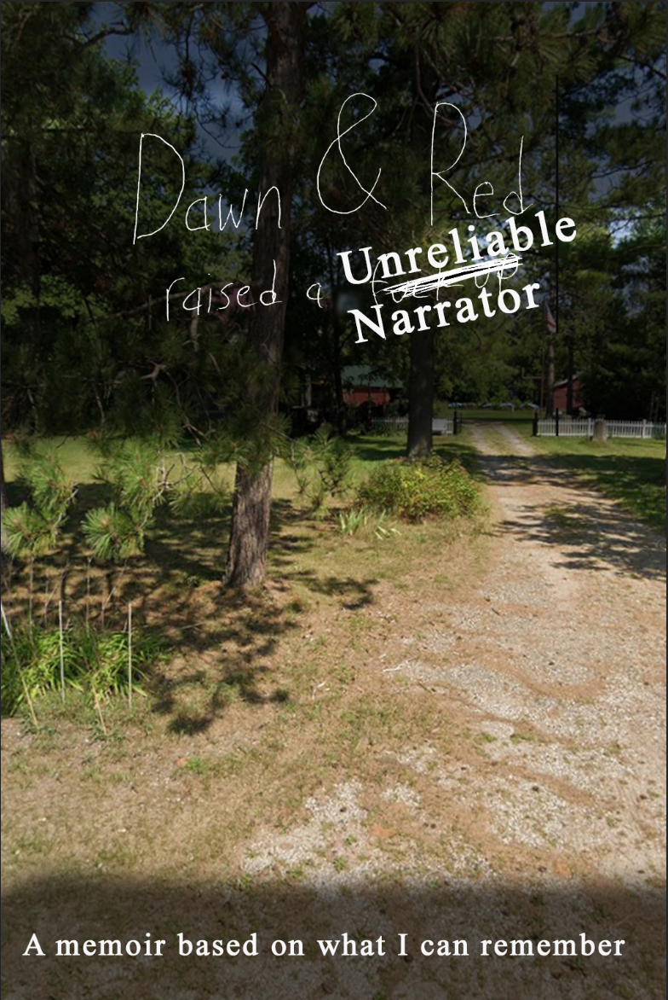

# Dawn & Red Raised an Unreliable Narrator
### A memoir based on what I can remember

---

## Prologue — Tomorrow's Train

Tomorrow my wife and I get on an Amtrak train to Portage, Wisconsin. That's the town where Dawn Rasmussen, nineteen years old, met a boilermaker's kid named Timothy DeBraal, and neither of them had any idea what they were starting. Fifty-some years later, here I am, writing this instead of just saying it to their faces, because apparently that's easier for me.

Quick disclaimer before we go any further: I am not a reliable narrator. I was either too young to understand half of what I was watching, or too high to remember it right even at the time, and sometimes both at once. Where my memory runs out I'm using what the family tells it as, and where even that runs out I'll just say so instead of making something up that sounds good. Mom and Dad are allowed to correct me. Encouraged to, actually. That's kind of the point of handing them this.

I didn't appreciate them growing up. Not a little bit. For most of my childhood and basically my entire twenties I treated them like a fire extinguisher — good to have around in an emergency, otherwise not worth a second thought. They paid rent I couldn't. They showed up when the cops did. In my own head, at the time, I called them exactly what that makes them sound like: a get-out-of-jail-free card. You don't feel grateful for a get-out-of-jail-free card. You just feel relieved, and you move on to the next thing you're about to screw up.

I'm forty-three now. I've got a wife I met on an app, a job I got with a resume and no degree, and a degree I went and got anyway because she told me to. I still owe my parents five hundred bucks every two weeks off a loan they gave me not that long ago — old habits. And somewhere in the last ten years, without me clocking the exact day, the fire extinguisher turned into two actual people, getting older in a house in Wautoma, with maybe — being honest about the math here, which I'd rather not be — less than ten years left between the two of them.

So instead of trying to say all this out loud and choking on it, I'm writing it down. Every story in this book was, at the time, evidence against me. Proof of what a mess I was, what a mess my friends were, what a mess we all made together. Give it enough time, though, and tragedy just turns into comedy on its own, whether you help it along or not. Cat shit turns into a story about my dad's back. A summer selling corn turns into a story about my mom's mercy. A boat named as a joke turns into the one thing I most wish I could track down still floating on Lake Winnebago.

Time plus tragedy equals comedy. That's the whole formula. I'm hoping it also equals love, on paper, that they can actually hold in their hands.

---

## Chapter One — Germania

My mom, Dawn Elizabeth Rasmussen, grew up in Germania, Wisconsin, which is small enough that most maps don't bother with it — an unincorporated crossroads in the Town of Shields, Marquette County, just south of the Waushara County line. Weirdly, it's got a more interesting backstory than a dot that size has any right to. Back in 1860 some Massachusetts preacher named Benjamin Hall — a guy who used to run a Millerite commune, meaning he was part of the crowd that genuinely believed the world was ending in 1844 and then had to figure out what to do with the rest of their lives when it didn't — showed up and started a religious commune right there. Big communal house, school, roads, farms, eventually a church. Hall died in 1879, the colony limped along into the 1890s, and then it just turned into a regular little farm town. Which, about seventy years later, produced my mother.

Her side of the family tree is messier than the town's history, honestly. Her mom everyone called "Bunny" — Bunny Rasmussen — and her actual biological dad was a guy named John Bean, who as far as anybody remembers lived down South somewhere, maybe the Carolinas. His last name never made it onto my mom. There's also a McKnight line somewhere in there too, nobody in my generation's totally sure how it connects, just that it's there.

Whatever happened between Bunny and John Bean, what came out the other side was a big loud pile of siblings: my mom had sisters Bonnie and Amy, brothers Bud and Gary. Gary ended up with three kids — Sam, Emily, and Anna. I went to Emily's wedding about six months before I met my wife, and Anna's after my wife and I were already married — didn't even notice the symmetry until I wrote it down just now. Both of them have kids of their own now, so Gary's a grandpa a few times over on a branch of this family I've barely touched in this book. There's also an Aunt Edna floating around somewhere, remembered fondly and vaguely, the way great-aunts usually are by the time they reach a nephew's nephew.

Grandma Bunny, from everything I've heard, was just a genuinely cool person. Smoked right up until the day she died and never pretended otherwise. She wrote a column for years in the little paper that covered a place like Germania — and not the boring who-visited-whom stuff either, from what I gather it ran on whatever she happened to be thinking about that week. My name shows up in there sometimes, apparently, buried on some microfilm reel at a county historical society I haven't gotten around to visiting. I'd like to find those someday. There's something kind of unbearably sweet about my grandmother writing her actual opinions into a local paper, unsupervised, week after week, while raising a daughter who'd eventually publish seven hundred stories of her own. So whatever writing gene my mom's got, it didn't come out of nowhere.

My mom grew up with more siblings than money, in a town founded by failed apocalypse preachers, with a dad she basically never knew and a mom who apparently never stopped watching the neighborhood closely enough to write about it every week. That's the dirt she grew out of.

---

## Chapter Two — The Boilermaker's Son

My dad, Timothy Peter DeBraal, grew up somewhere nearby, same general chunk of central Wisconsin, and everybody's called him "Red" for as long as anyone can remember — for the hair, which even gray now still gives away where the nickname came from. He had a brother, Rod, and a sister, Lauren, who died a while back — Lauren was married for a stretch to some guy who wrote nonfiction history books, and not one person I've asked can remember the man's name anymore. Which is exactly the kind of thing that disappears if nobody writes it down in time — the guy's whole career, gone, except the fact that he had one.

Dad's dad — my grandpa — was Fred Peter DeBraal, so "Peter" has now run three generations deep in this family without anybody planning it: Fred Peter, Timothy Peter, Ryan Peter. Grandpa Fred used to take my mom, my sister Nikki, and me out to eat at Peck's Plantation, which by the informal town ranking sat third among the local supper clubs — Silvercryst first, Moose Inn second, Peck's third. Turns out all three are real, documented Wautoma places, not just something I made up in my head: the Silvercryst's been sitting on Big Silver Lake since 1894 and is still open, still doing the fish fry. Moose Inn's still open too. Peck's sat on Bugh's Lake and was run for fifty-plus years by a guy named Harry Peck Sr., who actually got named the town's Outstanding Citizen of the Year in 1980 — and at some point after our lunches there, the place either burned down or got torn down, depending who's telling it. I remember eating salad heavy on radishes out of what I'm pretty sure were pewter bowls, and Grandpa always slipping me quarters for the new Mortal Kombat machine by the coat check. He liked flashing money around — I remember him opening his wallet once and there were several hundred-dollar bills folded in there, more cash in one spot than I'd ever seen in my life at that age. He lived in an apartment above Main Street, less than two hundred feet from the back door of Kabasta's — the same law office I'd later get trusted to clean, and then un-trusted to keep cleaning.

Fred drank a lot. "Womanized" a lot too, in the family's word for it. At least once he got jumped and robbed in Milwaukee and called my mom from jail around four in the morning asking her to bail him out. She said no. I think that call, or something said during it, is close to the actual root of whatever the falling-out was — nobody ever explained the details to me straight, just that at some point he said something genuinely cruel to my mom, and after that we stopped seeing him. The last time I did see him, he was in a nursing home that clearly wasn't treating him right, and when he looked at me he called me "Elliot" — my cousin's name, not mine. I didn't correct him.

Fred died with basically nothing. Funeral was in some cramped, dark, kind of shitty little room, only immediate family showed — not Deloras, who by then had every reason to skip it — and his whole estate came to four thousand dollars, split a thousand each between his four grandkids: Nikki, me, Elliot, and Lindsey. Even as a kid I remember thinking it was wild that an entire human life could end at a grand total of four grand. It was a shitty score.

Here's the part I genuinely did not know until recently, and I'm putting it down for the first time right now: a few years back, riding the Amtrak home from visiting my parents — same kind of trip that opens this book — my wife told me Fred had gone to prison for running someone over drunk driving. I have zero memory of ever hearing that before that moment on the train. I don't know if I was never told, or told once and lost it in the same fog that ate most of my twenties, or heard it so long ago and so secondhand it stopped registering as a fact about my own grandfather. I tried to find a court record to at least confirm the "did this actually happen" half of it and came up empty — Wisconsin's circuit court records are technically public, searchable by name at wcca.wicourts.gov, but it's a live lookup tool, not something you can just search into from a desk. So this is one of those spots where the unreliable-narrator warning up front is doing real work: I'm reporting something I can't verify, about a man I mostly remember for arcade quarters and a fat wallet, that would repaint every one of those memories if it's true. And I honestly don't know, writing this sentence, whether I ever knew it before.

Tim's mom, my grandma, was named Deloras. She got a specific, ugly kind of dementia later in life and got moved into a genuinely nice home, but she declined and died fast once she was there — faster than anybody expected. She'd already arranged to donate her body to science, which feels like a very practical last move from a generation of people who mostly made practical moves.

Deloras lived in Sheboygan, right on Lake Michigan, which meant every visit was a few degrees colder and a little more miserable than wherever we'd driven in from. Turns out that one's historically accurate too — the DeBraal name traces back to that exact stretch of Wisconsin, Dutch immigrants who settled around Cedar Grove and Oostburg in Sheboygan County back in the 1840s. Whatever pulled my great-great-grandparents to that particular lakeshore was apparently still pulling us back there, generations later, for Easter egg hunts and Christmas at Grandma's.

Easter at Deloras's meant egg hunting, and it also meant cannibal sandwiches — raw ground beef, onions, pepper, served open-faced on what everybody called Sheboygan hard rolls, which looked to me like plain rolls and were, to my dad, the single best bread on Earth. Turns out that's not some weird private family thing either — the cannibal sandwich is a real, documented Wisconsin tradition, descended from a German raw pork dish called "mett" or "hackepeter," and it's still eaten by the hundreds of pounds every Christmas across the state. Even the roll's its own regional institution, kept alive by two competing bakeries — City Bakery, started in 1939 by a German immigrant named Frederick Shrewi, and Johnston's, which started in 1950 originally just wholesaling hard rolls to the local grocery stores. So my family was just doing, at my grandma's table, exactly what German-Wisconsin families have been doing for about a hundred and fifty years. We just thought it was hers.

Dad became a boilermaker, which meant he spent his whole working life driving to wherever in Wisconsin the work was, and sometimes well past the state line. He worked for Boldt, then Enerfab, then a place called Doral. Up at four in the morning most weekdays, sometimes gone for weeks at a stretch — once he was gone to Lansing, Michigan for something like two months. The whole reason we lived in Wautoma comes down to his job: it's near the geographic center of the state, which just made it the smart move for a guy whose work could call him in any direction. Boldt, at least, is easy to check and genuinely a big deal: founded 1889 by a German immigrant carpenter in Appleton, still 100% employee-owned, still one of the biggest construction firms in the country. My dad spent years of overnight drives and month-long jobs away from home inside a 135-year-old Wisconsin company, whether he ever thought about it that way or not.

A house picked for its spot on a map, so a dad could reach more jobs faster, tells you something about the shape this marriage was going to take from the start. Whoever raised two kids day to day in that house was going to mostly be doing it alone, for long stretches, whether either of them said that part out loud when they picked the address or not.

---

## Chapter Three — Portage

They met in Portage, Wisconsin, which is the county seat of Columbia County and built right on the historic portage between the Fox and Wisconsin Rivers — the same route Marquette and Joliet noted back in 1673 on their way toward the Mississippi. Basically it's a town that exists because it sits at the exact point where you have to carry something from one side of the world to the other. Feels appropriate that it's also where my parents happened to meet.

The real mechanics of it are less poetic: they met because they were both living in the same motel, separate rooms, for reasons nobody's ever fully explained to me. My mom, to this day, downplays whatever was actually going on there — but if two twenty-somethings in adjoining rooms end up knowing all their neighbors well enough to fall for one of them, I've gotta assume the version I get is the edited cut. I've never pushed on it. Some chapters of your parents' lives, you're better off half-knowing.

Whatever was happening in that hallway, my mom married my dad there at nineteen. I've also got a photo, or at least a memory of one, of me as a baby sitting on the back of a motorcycle my dad owned at the time. He must've sold it at some point, because by the time I have any memories of my own, it's gone, and "Red" was already the boat-and-truck-rack guy instead of the motorcycle guy. I'd like to know what happened to that bike. I'd also like to know what actually happened in that motel. Both on the list for next visit.

What I know for sure is what happened after: a nineteen-year-old from Germania and a red-headed boilermaker's kid, fresh out of a motel hallway and off the back of a motorcycle, built an entire life — two kids, and something like fifty years — starting from a town that only exists because it's the spot where you carry something across.

---

## Chapter Four — A House That Used to Be a Farm

We ended up in Wautoma, in a house that used to be a working farm, which is relevant because when a tornado tore through in August 1992 — an F3 that cut a path half a mile wide and twenty-one miles long across Waushara County, killed at least one person, hurt around thirty, left about a hundred homeless — it had a barn on it to knock over. It knocked ours over. Governor Tommy Thompson put the county damage at around five million dollars; our whole contribution to that number was one flattened barn on land that used to grow something other than kids.

That name, Tommy Thompson, was not neutral in our house. My mom ran a one-woman feud with the guy for years, entirely by mail. She'd sit down and write him letters, write letters to newspapers, tell everybody to "write your congressman," fully convinced the man was doing a genuinely terrible job running the state. She was tilting at a pretty sturdy windmill — Thompson was governor from January 1987 to February 2001, longest run of any governor in Wisconsin history, re-elected three separate times while her letters kept showing up. I have no idea if his office ever read a single one, or if they went straight into some intern's recycling bin in Madison. Didn't matter to her. She wrote them anyway, year after year, out of the same part of her that would later write seven hundred short stories nobody made her write either — if you had something to say, you put it on paper and sent it to whoever needed to hear it, whether they wrote back or not, and whether the voters agreed with her or not.

That same storm tore Grace United Methodist apart — the church my mom cleaned and where we sat most Sundays — and left the altar and the big Bible on it completely untouched. When people went in after, the Bible had fallen open, or was found open, to a passage about surviving storms. Nobody's ever tried too hard to explain that one. It just happened, the kind of detail a small town hangs onto for decades because it doesn't need explaining to matter.

That same church, sometime around then, is where I've got my first real memory of being in trouble. I was racing another kid, Beck Pontow, down the aisle between the pews, going as fast as two kids can go on a floor that isn't built for it, and I had to grab the altar to stop myself before I hit the front wall. Broke a statue doing it. Don't remember what happened after — just remember, with total clarity, that I'd done something wrong and there was no talking my way out from under it. I spent the next twenty years re-testing that exact feeling to see if it still worked the same way. It generally did.

The house came with a rotating cast of animals that never seemed to quit: dogs named Barney, Wally, Cubby, Zee, Rudy, Kaily, Willy; cats named Stanley and Kenny. A farmhouse with that many name tags moving through it starts to feel less like a house and more like a small ongoing civic project — which about sums up most of what my mom ran out of that place for thirty years.

---

## Chapter Five — The Reflections

If you'd asked anybody in Wautoma in 1987 to name the town's talent, they'd probably have pointed you at a band of local moms calling themselves The Reflections. On March 27th of that year, four of them — my mom, Gena Pontow, Debbie Sutton-Johnson, and a woman I've always known as Julie Wagner — entered a talent contest and took first place playing a song my mom wrote herself, "Housewife Blues." Debbie left not long after; a percussionist named Pam Schmude joined later, and the trio that actually stuck around, on and off, over the years, was Dawn, Gena, and Julie. I knew her as Julie Wagner from the start — married, by then, to a plumber named Verne Wagner — but a 1987 write-up of that talent-contest win names her as "Julie Eger" instead, which is presumably whatever she went by before I have any memory of her. After Verne, she married again, to a guy everybody called Butch. Julie "Janet," maybe. I'm not fully sure on that last name.

Over the years the roster was a strange rotating door, the way small-town bands usually are: a cop named Don Binder played with them for a while — a guy remembered as both a cop and a drunk in the same breath — a man who ran a campground called Ti-Waushara sat in sometimes, a drummer named Lance came and went, a friend named David Davies' mom filled in a handful of times but never stuck. What stayed constant through every lineup change was those three women and whatever song my mom brought to rehearsal that week.

Don Binder eventually brought in a younger singer, a woman named Trina, and at some point him and whoever was backing him tried to just take the name "The Reflections" for themselves — walk off with it, like the name was separate from the women who built it. My mom pushed back and kept it where it belonged. Didn't save them from the market, though — for most of their run, The Reflections kept losing gigs to a rival local band called The Sweet Water Band, who played basically the same circuit but had more mass appeal by every account. My mom's band was the more interesting one and the less bookable one, which is a description that fits more of her life than just the band, honestly.

Somewhere in a family drawer there's an actual setlist for this thing — over a hundred songs long, the whole working repertoire they could take a request for. Runs from "Louie Louie" and "Twist and Shout" straight through Patsy Cline ("Crazy," "I Fall to Pieces"), gospel numbers, wedding standards ("Could I Have This Dance," "The Rose," "Three Bells"), a yodel song, and — sitting right there in the B's, totally unbothered by the company — "Housewife Blues," the song that started the whole thing. A setlist is basically an X-ray of every room a band ever had to win over, and this one shows a small-town Wisconsin band that could go straight from a gospel hymn into "Boot Scootin' Boogie" without anybody blinking. Full list's in Appendix A.

She never learned to read music. Played piano and guitar entirely by ear, wrote — by her own count and everyone else's — more songs than anybody bothered tracking. Some of the funniest ones weren't even for the band. For years she ran what we all call "birthday-grams" — before somebody's birthday she'd quietly go collect facts about them, embarrassing stuff, habits, whatever she could dig up, and turn it into an original comic song she'd then perform, live, straight at the person, usually with everyone they know standing right there. She also did improv at a bar for a while, which by this point in her story doesn't even feel like a new fact so much as the obvious next move.

Julie and Butch turn up again in my own life years later, completely by accident. I was at a friend's house one night and didn't want to stay over, so I asked his — let's just say stepdad — to drive me home. Guy was drunk as a skunk. In fairness, so was I. He got damn near the whole way there before we went off the road, and the two of us walked through the snow to the nearest house we could find, which turned out to be Julie's. Talk about luck. Butch came out and helped the guy dig his truck out of the ditch, and Julie drove me the rest of the way home herself. Small towns work like that sometimes — the same handful of people keep showing up in your life from different angles, whether they're onstage with your mother or just the nearest porch light when your night's gone sideways.

Debbie Sutton-Johnson, for what it's worth, was the first Black person I remember meeting, growing up in a town that didn't have many. We drove down to visit her family in Milwaukee once and I met more Black families in that one trip than I had in my entire life up to that point. Looking back, I don't think that was an accident. I think my mom was trying to show her kids there was a whole world outside Germania and Wautoma, using the one friendship she had that could actually carry us there.

---

## Chapter Six — Waushara Industries and the Courthouse

My mom's working life ran on at least two tracks that never seemed to slow each other down. She was the "musical director" at Waushara Industries, a place that employed people with intellectual and developmental disabilities — back then everybody used the word "retarded," no malice in it, that was just the word — and she'd go in and sing and play games with the people working there. The guy running the place, Rick King, had a son named Adam. Waushara Industries did contract packaging on the side, and one year that happened to be packaging Final Fantasy IV for Super Nintendo. Rick brought a copy home for Adam, but Adam only had a Sega Genesis, so he gave it to me instead. I still play JRPGs to this day, thirty-some years later, because of a chain of coincidences that starts with my mom singing songs at a sheltered workshop in central Wisconsin. Waushara Industries is still a real, operating organization today, out on East Chicago Road in Wautoma — decades into the same work, still doing it. Not some vague memory of a place.

She also cleaned for a living for years — the church, Kabasta's law office off Main Street, other local spots — before landing a courthouse job, zoning first, then Veterans Affairs, eventually a Veterans Benefits Specialist for the county. Stuck around local civic life long enough to serve on the school board for at least six years — long enough that when Nikki graduated eighth grade, and again when she graduated high school, and both of those same points for me, it was my own mother standing up handing us our diplomas.

She gave me a job once, cleaning Kabasta's alongside her — extra money, a shot at earning something, the kind of small trust a mom hands a kid she's hoping will step up to it. I did not step up to it. Slacked off, left the trash cans full, skipped the toilets, eventually started letting friends in the back to smoke weed in the basement while I was supposed to be working. Lost the job. Just another entry, at the time, in what felt like a very long list of disappointments I was racking up for her, one small failure at a time.

---

## Chapter Seven — The Home Wrecker and Puss Neck

Dad's other life ran on rye fields, deer stands, and a twenty-nine-foot Bayliner he and my mom bought and named — with the kind of joke that tells you everything about a marriage's sense of humor — "The Home Wrecker." So nice, the joke went, it would wreck your home, because you'd never want to be anywhere else but on it. They slipped it on the Fox River in Oshkosh, on docks that were, by family consensus, permanently covered in bird shit, and Dad would pilot it out at the absolute slowest possible speed the whole way to Lake Winnebago — more patient about that boat than about basically anything else in his life. We went tubing behind it. He'd go "trolling," his word, with up to six fishing rods hanging off posts at once, watching all of them at the same time like only a guy with that much patience could.

He hunted the way he fished — for years, real attention. Best story from that stretch is the twelve-point buck he watched all season, with a fist-sized goiter on its neck, which the family immediately nicknamed "Puss Neck." He finally shot it, and its head's been on the wall of the Wautoma house ever since — still there today, long after Dad quietly retired from both hunting and fishing. Now he just plants rye every year to watch the deer come through, no gun in hand, though he's said he'd make an exception to take my wife out fishing sometime, since she's never gone.

I don't know, as of right now, whether The Home Wrecker's still out there under somebody else's name, or got scrapped years ago. I looked. Couldn't find it. I'd like to, someday, same as I'd like to find my grandmother's newspaper columns — not because either would change anything, just because both feel like pieces of the record that shouldn't disappear because nobody thought to write them down in time.

---

## Chapter Eight — Corn, Windows, and the Long Apprenticeship of Getting Caught

The dump used to sit right next to our house, which is either a coincidence or the whole explanation for most of what follows. A friend and I once broke into a building near there I was one hundred percent sure was abandoned and smashed every window in it. It was not abandoned. A cop showed up not long after asking questions, and I caved almost instantly — never had much of a poker face — and spent the entire following summer selling corn in front of the Citgo to pay off the damage. Pretty well-calibrated punishment, honestly. Public, slow, impossible to forget. Probably exactly what my parents were going for.

That friend's mom called my mom not long after and told her, more or less directly, that I was a bad influence on her son and we couldn't hang around anymore. For the record: a few years later that same friend burned down the press box at our high school and torched a word I won't repeat into the football field with gasoline, along with another friend, and both of them got expelled for a year. After graduation, those same two got caught breaking into boats down in Oshkosh — possibly the exact same bird-shit docks The Home Wrecker was slipped at. Don't know if my mom ever said anything to that other woman once all that came out. Hope, in a small petty way, that she didn't need to.

---

## Chapter Nine — Niagara, Washington, and the Kind of Luck You Only Notice Later

There were good trips too, plenty of them, and one in particular sits right at the center of what I think of as the golden years, before things went sideways for me specifically. My mom, Nikki, and I drove out with Gena Pontow and her daughters, Randy and Beck, all the way to Niagara Falls and then on to D.C. Gena filmed most of it on a video camera the size of two shoeboxes stacked together. I spent almost the whole drive, both ways, hunched over one sheet of paper drawing a single BattleTech-style mech, just adding more detail instead of starting a new one — an early, undiluted version of whatever's still in me that plays JRPGs today.

In D.C., we went down into the Metro as six people and came up, for one genuinely terrible minute, as five. The subway doors closed with Nikki still on the platform, train pulling out with her standing there and the rest of us moving. My mom didn't panic — or didn't show it, if she did — pressed herself to the glass and pantomimed, big and slow enough to survive the distance and the noise, "next station." Nikki got it. Got on the next train, rode one stop, stepped off right into her mom's arms. Nobody in the family remembers this, after the fact, as anything but a good story — Mom's part in it retold for the joke of the pantomime, not the half-second where it might not have worked. That was pretty much how she processed anything scary: turn it into a bit, keep moving. Took me till adulthood to get what she'd actually done — read a nine-year-old's panic through subway glass and get it exactly right, first try, no second chance coming.

We also went to Cancún once with friends, and to Universal Studios through a connection of my mom's who worked there and got the whole family bumped to the front of every line. Didn't understand at the time how much of my childhood ran on my mom's friendships quietly doing work in the background. Understand it now.

---

## Chapter Ten — The Get-Out-of-Jail-Free Card

I was hell on wheels growing up. Want to say that up front, in those exact words, because it's the plainest, most accurate summary anybody's ever given me — including me. I'm fine now. This part's just the receipt.

One scene stands in for most of the rest. I'm in an efficiency apartment — the kind where the building just assigns you a roommate, no say in it — sitting around smoking weed one afternoon, and somebody knocks on my door. Guy in an orange Abercrombie sweater, the clean-cut look I'd have called a "Soc" if I'd been paying closer attention to *The Outsiders* in school. Second I open the door he pulls a badge off a beaded metal necklace. My roommate ratted me out on his way to get food. I hand the cop less than a gram of weed and figure that's the end of it.

Eighteen months later — long enough I'd genuinely written it off as fallen through the cracks — a court date shows up in the mail, right in the middle of the stretch I'm living with a friend for what was supposed to be a summer and turned into six months. Court wants to put me on probation, which means random drug tests, and I know two things for absolute certain: I'm never passing one, and once I'm in that system I'm never getting back out. So when they offer probation, I say no. They tell me the possession charge sits on my permanent record instead. I tell them that's better than a permanent leash. They take my license for six months, which is its own little joke — punishing a guy caught sitting at home with less than a gram of weed by taking away the one thing that would've let him drive to an actual job.

Not going to spend as many more pages on the rest of it as I spent living through it, so I'll compress. My parents bailed me out — literally, more than once — and helped me move more than once too. Failed out of tech school, lived with that same friend for what was supposed to be a summer and turned into six months, and when his family finally told me I had to go, I moved back in with my parents at twenty-one. Moved out again, moved to Oshkosh, failed out of school a second time, got a girlfriend, and about two months later my parents called and told me that at twenty-four, the money was stopping — no more rent, no more fifty bucks a week, all of which I'd been spending on weed without much ceremony.

The friend whose family took me in for those six months was named Fred. His dad, everybody called "Frenchie," and Fred's girlfriend at the time was named Sam. At some point in there my parents wanted to properly thank Frenchie's family for putting up with me, so they took the whole group of us — Fred, Frenchie, Sam, Mom, Dad — out to the Moose Inn for dinner. Genuinely good time. On the drive home a deer jumped out and tore up the front of the car.

Frenchie didn't have insurance on it. So he parked it out back, threw a tarp over it, sat on it a good while, then eventually filed a claim for hitting a deer — with the date quietly fudged to land inside a policy window that hadn't actually been active that night. For months afterward friends would ask why the car wasn't on the road, and we'd all say the same true-sounding, not-quite-true thing: hit a deer. Nobody's math ever added up right when we said it, and I think most of the people asking already suspected exactly what happened. Weird way to spend a few months of your life, walking around inside a small, shared, not-quite-secret.

Years later my mom — by then working Veterans Affairs at the Waushara County courthouse — ended up helping Frenchie directly. He'd served in the Navy young and was owed benefits he'd never claimed, and she made sure he got them. My dad, the welder, built him a ramp so he could get in and out of his own house easier — Frenchie was morbidly obese by then, and stairs had stopped being a small problem. Whatever else was true about that year, the fudged date, the tarp on the car, Frenchie was always good to me, and it says something about my parents that the story ends with them making his life easier instead of settling a score over an insurance claim none of them ever brought up again.

I thought I was going to end up homeless. Instead I filled out some resumes and landed a job at Kimberly-Clark paying eighty grand a year with no degree to my name. My parents had spent years being exactly what I called them in my head at the time — a get-out-of-jail-free card. What I didn't get yet was that the card had an expiration date they'd picked on purpose, and that wasn't cruelty. It was the last, hardest thing they had left to teach me, delivered exactly when I needed it and not one day sooner.

---

## Chapter Eleven — Full Circle

Didn't stick the first time, not all the way. Got laid off from that job eventually, lived three years off savings, ran the savings dry, had the electricity shut off twice, borrowed five grand from my parents just to keep functioning. Put in resumes again, landed a job at a major bank at eighty grand, got hired full-time not long after at a hundred grand — still no degree.

Met my wife on Bumble. She's an accounting major from South Korea, came over on an H1B, got her green card through Deloitte. We got married December 2018. She's the one who talked me into going back to school — I got a Bachelor's in Computer Science, cum laude, and I'm finishing a Master's in Cybersecurity right now.

When I finally moved out of an apartment in Oshkosh to head to Chicago, my parents helped clean the place out and drove me there themselves. I'd had a cat in that apartment for eight years and never once emptied the litter box — just kept dumping it into an industrial trash can that filled up, over most of a decade, to something like sixty gallons of accumulated cat shit. Couldn't lift it. My dad, already retired by then, could, and did, hauled it away without a word of complaint. Did not get my security deposit back on that place. Don't figure I earned it.

Even now, forty-three, married, two degrees either done or almost done, a career I built without either of them — I borrowed ten grand from my parents just a few months back, paying it off at five hundred bucks every two weeks. By my own count I'm still totally beholden to them, not because I never grew up, but because the debt was never really about the money. It was always about who kept showing up.

---

## Chapter Twelve — Nikki's Road

My sister took a different road through the same house. Graduated from a university in Milwaukee with a degree in advertising — "like in *Mad Men*," her words — and her first job out of school took her all the way to Georgia, working for a golf company. Married a guy named Stephan Watson, they've got two kids now, which makes my parents grandparents through that branch of the family in a way that, unlike my contributions to their gray hair, actually went according to plan.

I'll be honest, I don't have as much of Nikki's story yet as I want. This book's still getting built out of what I remember and what gets said out loud over the next visit or two, and her chapter deserves the same care mine got, even if mine took a lot longer to earn.

---

## Chapter Thirteen — Late Bloom

Mom retired somewhere in her sixties and, like a lot of people, needed something to do with her hands. Started with painting. Didn't take. Started writing instead, and that one did take — more than took, honestly; turned into a second career bigger and more visible than most people manage in a first one.

As of right now, Dawn DeBraal's published more than seven hundred short stories, drabbles, and poems across online mags and print anthologies, picked up a Pushcart Prize nomination, and written two novels. Her debut, *The Lord's Prayer: A Series of Horror*, came out in 2024 — fourteen stand-alone horror stories, each one keyed to a line of the prayer, each protagonist tested against the line it's named for — and it won the international Literary Global Book Award that year. Second book, *Broken People: A Collection of Societal Misfits*, came out July 2025. She also writes under a pen name, Garrison McKnight — shared with a co-author who goes by Copper Rose — for a novel called *what the hell happened to joan?*, and she's actually said on record, in an interview, exactly why the second name exists: "He takes all my shame." Uses McKnight for the stuff that needs distance, or a male voice she doesn't have on her own.

She calls herself a "pantser" — no outlines, works best off a prompt, sometimes drops a one-line note at the bottom of a draft just to hold a twist in place without breaking her own momentum. Builds characters off one real mannerism she's noticed in an actual person — somebody pursing their lips, fidgeting with their hair — and worries, by her own admission, about people recognizing themselves on the page. Loves horror, by her own definition, not for the gore but for "the creepy skin-prickling aha moments." One of her own protagonists is a Veterans Benefits Specialist — the exact job she held for years at the Waushara County courthouse — chasing down a decades-buried government secret. She wrote what she knew, then went looking, on the page, for the darker thing hiding underneath it.

She kicked this whole second act off, best anyone can tell, right around the end of 2018 — same winter, as it happens, that I got married. Two people in the same family starting something at the same time, on opposite ends of a long list of years spent mostly worrying about the other one's kid.

---

## Epilogue — The Train to Portage

Tomorrow my wife and I get on that train. We'll ride it into Portage, the town where a nineteen-year-old and a red-headed boilermaker's kid met fifty-plus years ago and decided, for reasons I'll probably never fully know, they were worth building a life around each other. From there to Wautoma, to the house that used to be a farm, to the wall where Puss Neck still hangs, to the rye fields Dad plants now instead of hunting them, to two people who are, by any honest math I can run, running out of time faster than I'm ready for.

I spent most of my life treating them like a safety net and almost none of it treating them like actual people — like a girl from a town founded by failed prophets who grew up to write horror stories and sing joke songs at birthday parties; like a guy who dodged a war by pretending to study welding and ended up genuinely loving it, who can lift a sixty-gallon drum of his idiot son's neglect without a word, who named a boat as a joke and meant every word of it.

Time plus tragedy equals comedy. I believe that most days now. But underneath the math there's a simpler line I want them to have in writing, in case I never manage to say it clean out loud: I would be dead, or in prison, ten times over, if it wasn't for the two of you. Everything else in this book is just the evidence.

I love you both. Thanks for the fifty bucks a week, and for cutting it off. Thanks for the cat litter, and for lifting it. Thanks for handing me my own diploma, twice, and for not saying anything when I clearly hadn't earned enough of it. Bringing this with me on the train.

— Ryan

---

## Appendix A — The Reflections Setlist

Preserved as found, in a family drawer, alphabetized and unedited — the full working repertoire of Gena, Julie, and Mom's band across its many lineups. A truer record of what a small-town Wisconsin bar band actually sounded like on a Saturday night than any story could give you.

There's also a YouTube playlist, literally titled "The Reflections," built as a reference companion to this list — original/reference recordings of the songs the band covered. The first several entries, confirmed:
- Blue to the Bone — [reference](https://www.youtube.com/watch?v=WGELC7K4vSQ)
- Blue Bayou (Linda Ronstadt) — [reference](https://www.youtube.com/watch?v=i_lzeHYNngE)
- Boot Scootin' Boogie (Brooks & Dunn) — [reference](https://www.youtube.com/watch?v=Q0JjHkhATfI)
- The Boy from New York City (The Ad Libs) — [reference](https://www.youtube.com/watch?v=3TPYmeSqLjc)
- Bye Bye Love (Everly Brothers) — [reference](https://www.youtube.com/watch?v=LRyrWN-fftE)
- Can't Buy Me Love (The Beatles) — [reference](https://www.youtube.com/watch?v=venzPNvge18)
- Could I Have This Dance (Anne Murray) — [reference](https://www.youtube.com/watch?v=2wagjpWtRII)
- Daddy's Hands (Holly Dunn) — [reference](https://www.youtube.com/watch?v=nOAjAWToYMI)
- Delta Dawn (Tanya Tucker) — [reference](https://www.youtube.com/watch?v=r0Xgt37rVOo)
- Eighties Ladies (K.T. Oslin) — [reference](https://www.youtube.com/watch?v=NMCik5SNcu4)

*(The full playlist runs longer than this — YouTube's feed only surfaces the first several entries via automated lookup. The rest can be pulled directly from the [playlist link](https://www.youtube.com/playlist?list=PLay3SBfM1KeiF4okXc_iujNmxufZDs6HH) if you want the complete companion list.)*

Good Love · At the Hop · Blueberries · Blue to the Bone · Blue Bayou · Blueberry Hill · Blue Skirt Waltz · Boogie Woogie · Boot Skootin' Boogie · Boy from NYC · Bye Bye Love · Can't Buy Me Love · Chains · Cindy, Oh Cindy · Come Next Monday · Could I Have This Dance · Crazy · Daddy's Hands · Daddy's Little Girl · Delta Dawn · Eighties Ladies · The End of the World · Everyday · Gospel Melody · Grandpa · Green Green Grass · Guess My Heart Has a Mind... · Hand Jive · Help Me Make It Through... · Here We Are · Hound Dog · House Wife Blues · I Can't Resist · I Fall to Pieces · I Feel Fine · If You Love Me · I Love · I'm Stickin' With You · It Ain't Easy Being Easy · It's in His Kiss · It's So Easy · I've Been Cheated · Jimmy Mac · Jolene · Just Because · Kawliga · La Bamba · Let Me Be There · Let's Dance · Do It Again (a little slower) · Little Arrows · Live for Lovin' You · Locomotion · Lollipop · Louie Louie · Love Can't Get Better... · Love Is a Rose · Love Me Tender · Luka · Magic Moments · Man in My Pocket · Maybe Baby · Men · Mountain of Love · My Boyfriend's Back · Never Ending Love for You · 99 Ways · Oh My My · Oh Lonesome Me · Proud Mary · Queen of Hearts · Release Me · Rescue Me · Rock Me Gently · Rockin' Robin · Rocky Top · Roll Out the Barrel · Saturday Nite · You Take My Self Control · She's in Love With the Boy · Silhouettes · 16 Reasons Why... · Slap Her Down Again, Pa · Slow Boat to China · Stand By Me · Summertime Blues · Suspicious Minds · Sweet Little Lies · Take It Easy · Tear in My Beer · Tell Me Baby · That'll Be the Day · The Boat That I Row · There Ain't No Room · The Rose · The Tide Is High · The Woman Before Me · Those Memories · Three Bells · Time After Time · Titanic Baby · To Know Him... · Torn Between Two Lovers · Turnin' Away · Twist and Shout · Until It Happens to You · Walkin' on Sunshine · Walkin' Shoes · When a Man Loves a Woman · Why Have You Left the One... · Wild Thing · Windy · Yodel Song · You Won't See Me

---

## Appendix B — Notes on Sources

This book is a family's memory, not a court record, and it should be read that way. Most of what's in here comes from one person's recollection (mine) of stories told by, or about, two other people (Dawn and Tim), which means most of it is just plain unverifiable the way a news article is verifiable — and that's fine, that's what a memoir is. But wherever a detail touched something with an actual public record behind it — a storm, a governor, a town's founding, a business still open today — I checked it, and I'm listing that work here instead of hiding it, so you can see exactly where "this is documented" stops and "this is what we all remember, and choose to believe" starts.

**Verified against a public record or independent source:**
- Grace United Methodist Church is a real, active congregation in Wautoma, WI; current building dates to a 1948–1951 construction campaign.
- Germania, Wisconsin is a real unincorporated community in the Town of Shields, Marquette County, founded 1860 as a Millerite religious commune led by Benjamin Hall, who died 1879; the colony dissolved by the 1890s.
- Portage, Wisconsin's history as the historic Fox–Wisconsin portage, noted by Marquette and Joliet in 1673, and as Columbia County's seat since 1851, is documented history.
- Dawn DeBraal's Waushara County courthouse employment (Veterans Service Office) is independently confirmed by a real staff phone-extension directory listing "DeBraal, Dawn."
- The August 1992 Waushara County tornado (F3, roughly half a mile wide, 21-mile path, at least one fatality, ~30 injured, ~100 left homeless, ~$5 million in damage per Governor Tommy Thompson's public estimate) is documented in contemporary press.
- Tommy Thompson's tenure as Wisconsin governor (January 1987–February 2001, longest in state history, re-elected three times) is documented public record.
- The March 27, 1987 Wautoma talent-contest win, the original band lineup, the song "Housewife Blues," and percussionist Pam Schmude joining later, are documented in a 2020 blog post — the one outside source that directly named the band. That source names the fourth member as "Julie Eger" rather than "Julie Wagner"; the author's own lifelong memory of her is as Julie Wagner, so the book uses that name and notes the discrepancy rather than picking one as more "correct." Everything about later lineups (Don Binder, Trina, Lance, Ti-Waushara, the Sweet Water Band rivalry, the name dispute) is family memory only; no independent source found.
- Lindsay/Lindsey (spelling unconfirmed) is confirmed by the author as Lauren DeBraal's daughter — this explains her presence among "Fred's four grandkids" in Chapter Two despite Lauren never otherwise appearing as a parent in this book.
- Dawn DeBraal's literary career is extensively documented: 700+ published stories/poems/drabbles; a 2019 Pushcart Prize nomination; two novels, *The Lord's Prayer: A Series of Horror* (2024, Literary Global Book Award winner) and *Broken People: A Collection of Societal Misfits* (2025); the pen name "Garrison McKnight," shared with co-author "Copper Rose," used for *what the hell happened to joan?*; the "He takes all my shame" quote, from a real author-spotlight interview.
- Peck's Plantation Supper Club & Motel (Bugh's Lake, Wautoma), the Silvercryst Supper Club & Resort (Big Silver Lake, est. 1894), and the Moose Inn (Wautoma) are all real, documented places.
- The DeBraal surname's documented Wisconsin roots trace to Dutch immigrants settling in Cedar Grove/Oostburg, Sheboygan County, in the 1840s — a real general fact about the surname, not a confirmed direct link to Fred and Deloras's specific household.
- The cannibal sandwich is a real, documented Wisconsin tradition descended from German "mett"/"hackepeter," and the Sheboygan hard roll is a real regional bread tradition kept alive by City Bakery (founded 1939) and Johnston's Bakery (founded 1950).
- Waushara Industries, Inc. is a real, currently operating organization at 210 E Chicago Rd, Wautoma, providing vocational and sheltered-workshop programming for people with disabilities for decades.
- The Boldt Company is real and substantial: founded 1889 in Appleton by a German immigrant carpenter, still 100% employee-owned, still one of the largest construction firms in the country. Enerfab and Doral were not independently verified — plausible, common industrial-contractor names, but no specific record was checked or found.

**Family memory only — no independent record found, and none expected:**
- "Bunny" Rasmussen's newspaper column, Aunt Edna, Dawn's siblings (Bonnie, Amy, Bud, Gary), and Dawn's biological father John Bean all remain unconfirmed by public record search. These are private individuals; the absence of a paper trail is normal, not suspicious.
- Fred Peter DeBraal and Deloras DeBraal — no independent obituary or record was located; their story here is entirely as told by family, including the unconfirmed claim that Fred was imprisoned for a drunk-driving death, which the author himself only recently learned and cannot independently verify (see Chapter Two).
- The exact origin of "Garrison McKnight" as a McKnight-family reference is the family's own belief; Dawn's own public interview explains the name differently and doesn't mention a family connection.
- The band's later lineups, the Fred/Frenchie/deer/insurance story, the "Elliot" nursing-home moment, Grandpa Fred's cash-flashing and the Mortal Kombat quarters, the DC subway scare, the Cancún and Universal Studios trips, the Kabasta's job, the corn-selling summer, the press-box arson (someone else's, not this family's), the boat-breaking arrests, and essentially all of Chapters Eight through Twelve are personal recollection, not independently sourced — exactly what you'd expect from the parts of a family's life that never had a reason to make the news.
- The Home Wrecker's current whereabouts (if it still exists) and the newspaper columns Bunny wrote were both actively searched for and not found; both remain open leads, not closed ones.

Where this book states something as fact without a citation above, treat it as family account unless the sentence says otherwise. That's the honest posture for a memoir like this one, and the one it tries to keep all the way through.
